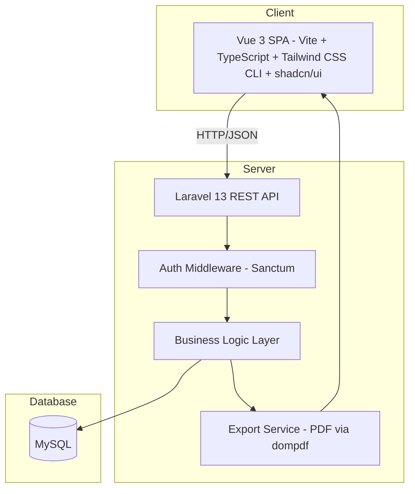
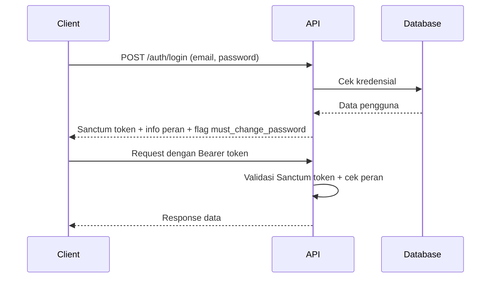
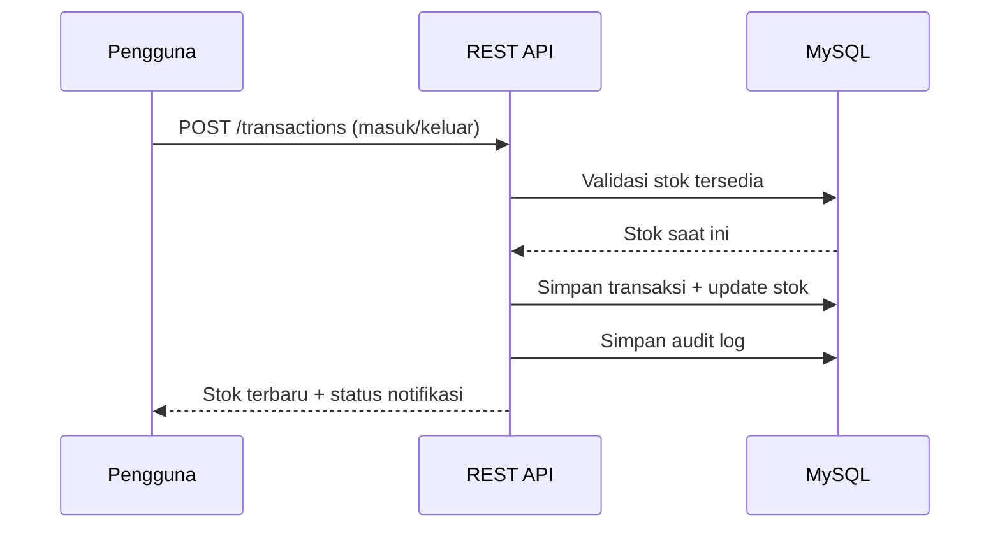
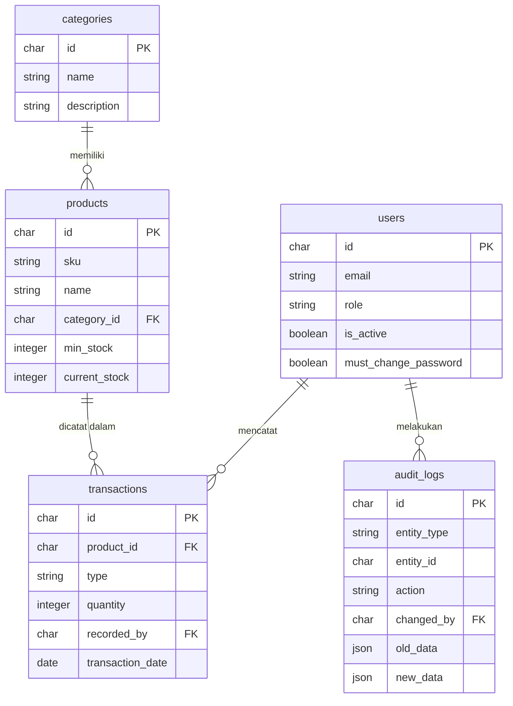

# Dokumen Desain: Inventory Monitoring Toko Agen Minuman

## Ikhtisar

Sistem ini adalah aplikasi web untuk monitoring stok toko grosir agen minuman. Aplikasi berbasis website yang responsif dan dapat diakses melalui perangkat mobile, memungkinkan Pengelola dan Kasir memantau ketersediaan stok secara real-time, mencatat transaksi masuk/keluar, dan menerima notifikasi ketika stok mendekati batas minimum.

**Tujuan utama:**
- Mengurangi risiko kehabisan stok melalui monitoring real-time
- Mempermudah pencatatan transaksi masuk dan keluar
- Menyediakan laporan dan audit trail untuk pengambilan keputusan

**Teknologi yang digunakan:**
- Framework: Laravel 13, PHP ^8.3
- Frontend: Vite + Vue 3 + Tailwind CSS CLI + shadcn/ui — desain responsif mobile-friendly (all-in-one dalam satu project)
- Backend: Laravel REST API
- Database: MySQL
- Autentikasi: Laravel Sanctum
- Export: PDF via `barryvdh/laravel-dompdf`
- Base API URL lokal: `http://127.0.0.1:8000/api`

---

## Arsitektur

Sistem menggunakan arsitektur **client-server** dengan pemisahan yang jelas antara frontend SPA dan backend REST API.



**Alur autentikasi:**



**Alur transaksi stok:**



---

## Komponen dan Antarmuka

### Komponen Frontend

Semua komponen UI menggunakan shadcn/ui sebagai base component library (Button, Input, Table, Dialog, Select, Badge, dll.) yang dikombinasikan dengan Tailwind CSS CLI untuk styling responsif mobile-friendly. Frontend dibangun dengan Vue 3 + Vite + TypeScript.

| Komponen | Deskripsi |
|---|---|
| `LoginPage` | Halaman login dengan form email/password menggunakan shadcn/ui `Input` dan `Button` |
| `DashboardPage` | Halaman utama dengan ringkasan stok dan notifikasi menggunakan shadcn/ui `Card` |
| `ProductListPage` | Daftar produk dengan pencarian, filter kategori, dan indikator stok menggunakan shadcn/ui `Table` dan `Badge` |
| `ProductFormPage` | Form tambah/edit produk menggunakan shadcn/ui `Dialog` atau halaman terpisah |
| `CategoryPage` | Manajemen kategori menggunakan shadcn/ui `Table` dan `Dialog` |
| `TransactionInPage` | Form pencatatan transaksi masuk (Pengelola) menggunakan shadcn/ui `Select` dan `Input` |
| `TransactionOutPage` | Form pencatatan transaksi keluar (Pengelola & Kasir) |
| `LowStockPage` | Halaman ringkasan produk stok rendah/habis menggunakan shadcn/ui `Badge` untuk status |
| `ReportPage` | Laporan stok dan riwayat transaksi dengan filter dan ekspor PDF |
| `AuditTrailPage` | Riwayat perubahan data dengan filter menggunakan shadcn/ui `Table` |
| `UserManagementPage` | Manajemen akun pengguna (Pengelola) |
| `ChangePasswordPage` | Halaman ganti kata sandi (wajib saat login pertama) |

### REST API Endpoints

**Autentikasi**
```
POST   /api/auth/login
POST   /api/auth/logout
POST   /api/auth/change-password
GET    /api/auth/me                  # info pengguna yang sedang login
```

**Produk**
```
GET    /api/products              # daftar produk (search, filter kategori, pagination)
POST   /api/products              # tambah produk [Pengelola]
GET    /api/products/:id          # detail produk
PUT    /api/products/:id          # update produk [Pengelola]
DELETE /api/products/:id          # hapus produk [Pengelola]
GET    /api/products/low-stock    # produk stok rendah/habis [Pengelola]
```

**Kategori**
```
GET    /api/categories
POST   /api/categories            # [Pengelola]
PUT    /api/categories/:id        # [Pengelola]
DELETE /api/categories/:id        # [Pengelola]
```

**Transaksi**
```
GET    /api/transactions          # riwayat (filter tanggal, jenis, produk, pagination)
POST   /api/transactions/in       # transaksi masuk [Pengelola]
POST   /api/transactions/out      # transaksi keluar [Pengelola, Kasir]
```

**Laporan**
```
GET    /api/reports/stock-summary         # ringkasan stok + nilai total
GET    /api/reports/export?type=stock     # ekspor PDF stok [Pengelola]
GET    /api/reports/export?type=transactions # ekspor PDF transaksi [Pengelola]
```

**Pengguna**
```
GET    /api/users                 # [Pengelola]
POST   /api/users                 # buat akun baru [Pengelola]
PUT    /api/users/:id/deactivate  # nonaktifkan akun [Pengelola]
```

**Audit Trail**
```
GET    /api/audit-logs            # [Pengelola] (filter jenis aksi, pengguna, tanggal)
```

---

## Model Data

### Tabel `users`

```sql
CREATE TABLE users (
    id            CHAR(36) PRIMARY KEY DEFAULT (UUID()),
    email         VARCHAR(255) UNIQUE NOT NULL,
    password_hash VARCHAR(255) NOT NULL,
    role          ENUM('pengelola', 'kasir') NOT NULL,
    is_active     TINYINT(1) NOT NULL DEFAULT 1,
    must_change_password TINYINT(1) NOT NULL DEFAULT 0,
    created_at    DATETIME NOT NULL DEFAULT CURRENT_TIMESTAMP,
    updated_at    DATETIME NOT NULL DEFAULT CURRENT_TIMESTAMP ON UPDATE CURRENT_TIMESTAMP
);
```

### Tabel `categories`

```sql
CREATE TABLE categories (
    id          CHAR(36) PRIMARY KEY DEFAULT (UUID()),
    name        VARCHAR(100) UNIQUE NOT NULL,
    description TEXT,
    created_at  DATETIME NOT NULL DEFAULT CURRENT_TIMESTAMP,
    updated_at  DATETIME NOT NULL DEFAULT CURRENT_TIMESTAMP ON UPDATE CURRENT_TIMESTAMP
);
```

### Tabel `products`

```sql
CREATE TABLE products (
    id            CHAR(36) PRIMARY KEY DEFAULT (UUID()),
    sku           VARCHAR(50) UNIQUE NOT NULL,
    name          VARCHAR(255) NOT NULL,
    category_id   CHAR(36) NOT NULL,
    unit          VARCHAR(50) NOT NULL,
    buy_price     DECIMAL(15, 2) NOT NULL,
    sell_price    DECIMAL(15, 2) NOT NULL,
    min_stock     INT NOT NULL DEFAULT 0,
    current_stock INT NOT NULL DEFAULT 0,
    created_at    DATETIME NOT NULL DEFAULT CURRENT_TIMESTAMP,
    updated_at    DATETIME NOT NULL DEFAULT CURRENT_TIMESTAMP ON UPDATE CURRENT_TIMESTAMP,
    CONSTRAINT chk_min_stock CHECK (min_stock >= 0),
    CONSTRAINT fk_products_category FOREIGN KEY (category_id) REFERENCES categories(id)
);
```

> `current_stock` diperbarui secara atomik setiap kali transaksi masuk/keluar dicatat, menggunakan database transaction untuk menjaga konsistensi dan mencegah race condition.

### Tabel `transactions`

```sql
CREATE TABLE transactions (
    id             CHAR(36) PRIMARY KEY DEFAULT (UUID()),
    product_id     CHAR(36) NOT NULL,
    type           ENUM('masuk', 'keluar') NOT NULL,
    quantity       INT NOT NULL,
    price_per_unit DECIMAL(15, 2) NOT NULL,
    supplier_name  VARCHAR(255) NULL,          -- diisi untuk transaksi masuk
    transaction_date DATE NOT NULL,
    recorded_by    CHAR(36) NOT NULL,
    created_at     DATETIME NOT NULL DEFAULT CURRENT_TIMESTAMP,
    CONSTRAINT chk_quantity CHECK (quantity > 0),
    CONSTRAINT fk_transactions_product FOREIGN KEY (product_id) REFERENCES products(id),
    CONSTRAINT fk_transactions_user FOREIGN KEY (recorded_by) REFERENCES users(id)
);
```

### Tabel `audit_logs`

```sql
CREATE TABLE audit_logs (
    id          CHAR(36) PRIMARY KEY DEFAULT (UUID()),
    entity_type VARCHAR(50) NOT NULL,   -- 'product', 'category', 'user', 'transaction'
    entity_id   CHAR(36) NOT NULL,
    action      ENUM('create', 'update', 'delete') NOT NULL,
    changed_by  CHAR(36) NOT NULL,
    old_data    JSON NULL,
    new_data    JSON NULL,
    created_at  DATETIME NOT NULL DEFAULT CURRENT_TIMESTAMP,
    CONSTRAINT fk_audit_logs_user FOREIGN KEY (changed_by) REFERENCES users(id)
);

-- Indeks untuk query audit trail
CREATE INDEX idx_audit_logs_created_at ON audit_logs(created_at);
CREATE INDEX idx_audit_logs_entity_type ON audit_logs(entity_type);
CREATE INDEX idx_audit_logs_changed_by ON audit_logs(changed_by);
```

### Indeks Performa

```sql
CREATE INDEX idx_products_sku ON products(sku);
CREATE INDEX idx_products_category_id ON products(category_id);
CREATE INDEX idx_products_current_stock ON products(current_stock);
CREATE INDEX idx_transactions_product_id ON transactions(product_id);
CREATE INDEX idx_transactions_type ON transactions(type);
CREATE INDEX idx_transactions_date ON transactions(transaction_date);
CREATE INDEX idx_transactions_recorded_by ON transactions(recorded_by);
```

### Relasi Antar Entitas




---

## Correctness Properties

*A property is a characteristic or behavior that should hold true across all valid executions of a system — essentially, a formal statement about what the system should do. Properties serve as the bridge between human-readable specifications and machine-verifiable correctness guarantees.*

### Property 1: Round-trip data produk

*Untuk setiap* produk dengan data valid (nama, SKU unik, kategori, satuan, harga beli >= 0, harga jual >= 0, stok minimum >= 0), menyimpan produk lalu mengambilnya kembali harus menghasilkan data yang identik dengan data yang disimpan, dan produk tersebut harus muncul dalam daftar produk.

**Validates: Requirements 1.1, 1.2**

---

### Property 2: Keunikan SKU

*Untuk setiap* dua produk yang berbeda dengan Kode_SKU yang sama, sistem harus menolak penyimpanan produk kedua dengan pesan kesalahan yang menyebut duplikasi SKU.

**Validates: Requirements 1.3**

---

### Property 3: Validasi field wajib produk

*Untuk setiap* kombinasi field wajib produk yang dikosongkan (nama, SKU, kategori, satuan, harga beli, harga jual), sistem harus menolak penyimpanan dan pesan kesalahan harus menyebutkan field mana yang kosong.

**Validates: Requirements 1.4**

---

### Property 4: Update produk tersimpan

*Untuk setiap* produk yang sudah ada dan data update yang valid, memperbarui produk lalu mengambilnya kembali harus menghasilkan data terbaru (bukan data lama).

**Validates: Requirements 1.5**

---

### Property 5: Hapus produk tanpa transaksi

*Untuk setiap* produk yang tidak memiliki riwayat transaksi, menghapus produk tersebut harus menyebabkan produk tidak ditemukan dalam sistem (GET /api/products/:id mengembalikan 404).

**Validates: Requirements 1.6**

---

### Property 6: Proteksi hapus produk bertransaksi

*Untuk setiap* produk yang memiliki minimal satu riwayat transaksi, mencoba menghapus produk tersebut harus ditolak oleh sistem dengan kode error `BUSINESS_RULE_VIOLATION`.

**Validates: Requirements 1.7**

---

### Property 7: Pencarian produk

*Untuk setiap* query pencarian (substring nama atau SKU), semua produk yang dikembalikan harus mengandung query tersebut dalam nama atau SKU-nya, dan semua produk yang mengandung query tersebut harus muncul dalam hasil (tidak ada yang terlewat).

**Validates: Requirements 1.8**

---

### Property 8: Filter produk berdasarkan kategori

*Untuk setiap* kategori yang dipilih sebagai filter, semua produk yang dikembalikan harus memiliki `category_id` yang sama dengan filter tersebut, dan tidak ada produk dari kategori lain yang muncul.

**Validates: Requirements 1.9**

---

### Property 9: Validasi stok minimum tidak negatif

*Untuk setiap* nilai stok minimum yang kurang dari nol, sistem harus menolak penyimpanan produk dengan pesan "Stok minimum tidak boleh kurang dari 0".

**Validates: Requirements 1.10**

---

### Property 10: Round-trip data kategori

*Untuk setiap* kategori dengan nama unik dan valid, menyimpan kategori lalu mengambilnya kembali harus menghasilkan data yang identik (nama dan deskripsi), dan kategori tersebut harus muncul dalam daftar kategori.

**Validates: Requirements 2.1, 2.2**

---

### Property 11: Keunikan nama kategori

*Untuk setiap* dua kategori dengan nama yang sama, sistem harus menolak penyimpanan kategori kedua dengan pesan "Nama kategori sudah digunakan".

**Validates: Requirements 2.3**

---

### Property 12: Cascade update nama kategori ke produk

*Untuk setiap* kategori yang memiliki N produk terkait, memperbarui nama kategori harus menyebabkan semua N produk tersebut menampilkan nama kategori yang baru ketika diambil dari sistem.

**Validates: Requirements 2.4**

---

### Property 13: Proteksi hapus kategori berisi produk

*Untuk setiap* kategori yang memiliki minimal satu produk terdaftar, mencoba menghapus kategori tersebut harus ditolak oleh sistem dengan pesan "Kategori tidak dapat dihapus karena masih memiliki produk".

**Validates: Requirements 2.5**

---

### Property 14: Hapus kategori kosong

*Untuk setiap* kategori yang tidak memiliki produk terdaftar, menghapus kategori tersebut harus menyebabkan kategori tidak ditemukan dalam sistem.

**Validates: Requirements 2.6**

---

### Property 15: Invariant aritmatika stok

*Untuk setiap* produk dengan stok awal S:
- Jika transaksi masuk dengan jumlah Q dicatat (Q bilangan bulat positif), stok setelah transaksi harus sama dengan S + Q.
- Jika transaksi keluar dengan jumlah Q dicatat (Q bilangan bulat positif, Q <= S), stok setelah transaksi harus sama dengan S - Q.

**Validates: Requirements 3.1, 4.1**

---

### Property 16: Round-trip data transaksi

*Untuk setiap* transaksi (masuk maupun keluar) yang dicatat dengan data valid, mengambil riwayat transaksi harus menghasilkan entri yang mengandung semua field yang dicatat:
- Transaksi masuk: tanggal, nama supplier, jumlah, harga beli per unit, nama pencatat.
- Transaksi keluar: tanggal, jumlah, harga jual per unit, nama pencatat.

**Validates: Requirements 3.2, 4.2**

---

### Property 17: Validasi jumlah transaksi

*Untuk setiap* nilai jumlah transaksi (masuk maupun keluar) yang kurang dari atau sama dengan nol, atau yang bukan bilangan bulat (misalnya desimal), sistem harus menolak pencatatan transaksi dengan pesan yang sesuai.

**Validates: Requirements 3.3, 3.4, 4.4, 4.5**

---

### Property 18: Response API mengandung stok terbaru

*Untuk setiap* transaksi (masuk maupun keluar) yang berhasil disimpan, response API harus mengandung nilai `current_stock` terbaru dari produk yang bersangkutan.

**Validates: Requirements 3.5, 4.6**

---

### Property 19: Proteksi stok negatif

*Untuk setiap* produk dengan stok S dan transaksi keluar dengan jumlah Q > S, sistem harus menolak transaksi tersebut dengan pesan "Jumlah melebihi stok yang tersedia", dan stok produk tidak boleh berubah.

**Validates: Requirements 4.3**

---

### Property 20: Klasifikasi status stok

*Untuk setiap* pasangan nilai (stok, stok_minimum), fungsi klasifikasi status harus mengembalikan:
- `"normal"` jika stok > stok_minimum
- `"rendah"` jika 0 < stok <= stok_minimum
- `"habis"` jika stok = 0

Klasifikasi ini harus diperbarui secara otomatis setelah setiap transaksi masuk maupun keluar, mencakup pemulihan ke status "normal" ketika stok kembali di atas stok_minimum.

**Validates: Requirements 5.1, 5.3, 3.6, 5.5**

---

### Property 21: Trigger notifikasi stok rendah

*Untuk setiap* produk dengan stok awal > stok_minimum, jika transaksi keluar menyebabkan stok turun ke nilai <= stok_minimum, maka response API harus mengandung notifikasi peringatan stok rendah untuk produk tersebut.

**Validates: Requirements 5.2**

---

### Property 22: Daftar produk stok rendah terurut

*Untuk setiap* set produk dengan berbagai nilai stok dan stok_minimum, daftar produk stok rendah harus:
1. Hanya mengandung produk dengan stok <= stok_minimum.
2. Diurutkan berdasarkan selisih (stok - stok_minimum) dari yang terkecil (paling kritis) ke yang terbesar.

**Validates: Requirements 5.4**

---

### Property 23: Kelengkapan dan akurasi laporan ringkasan stok

*Untuk setiap* set produk dalam sistem, laporan ringkasan stok harus mengandung entri untuk setiap produk dengan semua field yang diperlukan: nama produk, Kode_SKU, stok saat ini, stok minimum, dan status stok. Nilai total stok yang ditampilkan harus sama dengan sum(current_stock × buy_price) untuk semua produk.

**Validates: Requirements 6.1, 6.6**

---

### Property 24: Filter transaksi berdasarkan rentang tanggal

*Untuk setiap* rentang tanggal [start, end] yang valid (start <= end), semua transaksi yang dikembalikan harus memiliki tanggal dalam rentang tersebut, dan tidak ada transaksi di luar rentang yang dikembalikan.

**Validates: Requirements 6.2**

---

### Property 25: Validasi urutan tanggal filter

*Untuk setiap* pasangan tanggal di mana tanggal awal lebih besar dari tanggal akhir, sistem harus menolak permintaan filter tersebut dengan pesan "Tanggal awal tidak boleh lebih besar dari tanggal akhir".

**Validates: Requirements 6.3**

---

### Property 26: Filter transaksi berdasarkan jenis

*Untuk setiap* filter jenis transaksi (masuk atau keluar), semua transaksi yang dikembalikan harus memiliki jenis yang sesuai dengan filter, dan tidak ada transaksi dengan jenis lain yang muncul.

**Validates: Requirements 6.4**

---

### Property 27: Ekspor PDF valid

*Untuk setiap* set data yang diekspor, file PDF yang dihasilkan harus: (1) memiliki format PDF yang valid dan dapat dibuka, (2) mengandung semua data sesuai filter aktif, (3) memiliki nama file yang mengandung tanggal ekspor.

**Validates: Requirements 6.5**

---

### Property 28: Autentikasi dengan kredensial valid

*Untuk setiap* pengguna aktif dengan email dan password yang valid, proses login harus menghasilkan Sanctum token yang valid beserta informasi peran dan flag `must_change_password`.

**Validates: Requirements 7.2**

---

### Property 29: Penolakan kredensial tidak valid

*Untuk setiap* kombinasi email/password yang tidak terdaftar atau salah, sistem harus menolak login dengan pesan generik "Email atau kata sandi salah" (tanpa membedakan apakah email atau password yang salah, untuk mencegah user enumeration).

**Validates: Requirements 7.3**

---

### Property 30: Proteksi endpoint tanpa autentikasi

*Untuk setiap* endpoint yang dilindungi, request tanpa JWT token yang valid harus mendapat respons 401 Unauthorized, dan tidak ada data yang dikembalikan.

**Validates: Requirements 7.4**

---

### Property 31: Otorisasi berbasis peran Kasir

*Untuk setiap* endpoint yang hanya diizinkan untuk Pengelola, request dengan JWT token Kasir yang valid harus mendapat respons 403 Forbidden dengan pesan "Anda tidak memiliki izin untuk mengakses halaman ini".

**Validates: Requirements 7.6, 7.7**

---

### Property 32: Keunikan email pengguna

*Untuk setiap* dua akun dengan email yang sama, sistem harus menolak pembuatan akun kedua dengan pesan "Email sudah terdaftar".

**Validates: Requirements 7.9**

---

### Property 33: Flag ganti password pertama kali

*Untuk setiap* akun baru yang dibuat oleh Pengelola, login pertama dengan password sementara harus menghasilkan response yang mengandung flag `must_change_password = true`, dan pengguna tidak dapat mengakses halaman utama sebelum mengganti password.

**Validates: Requirements 7.10**

---

### Property 34: Pencabutan akses akun yang dinonaktifkan

*Untuk setiap* akun yang dinonaktifkan oleh Pengelola, semua request berikutnya menggunakan token akun tersebut harus ditolak dengan 401 Unauthorized, meskipun token belum kedaluwarsa.

**Validates: Requirements 7.11**

---

### Property 35: Kelengkapan audit log

*Untuk setiap* operasi yang dilakukan pada entitas yang diaudit (produk, kategori, transaksi), audit log harus mengandung entri dengan: `entity_type`, `entity_id`, `action`, `changed_by` (ID pengguna), `old_data`, `new_data`, dan `created_at` (timestamp operasi).

**Validates: Requirements 8.1, 8.2**

---

### Property 36: Filter audit trail

*Untuk setiap* kombinasi filter audit trail (jenis aksi, nama pengguna, rentang tanggal), semua entri yang dikembalikan harus sesuai dengan semua filter yang aktif secara bersamaan (AND logic).

**Validates: Requirements 8.3**

---

## Penanganan Error

### Strategi Umum

Semua error dikembalikan dalam format JSON yang konsisten:

```json
{
  "success": false,
  "error": {
    "code": "VALIDATION_ERROR",
    "message": "Pesan error yang dapat dibaca pengguna",
    "fields": ["field1", "field2"]  // opsional, untuk validasi form
  }
}
```

### Kode Error

| Kode HTTP | Kode Error | Kondisi |
|---|---|---|
| 400 | `VALIDATION_ERROR` | Input tidak valid (field kosong, format salah, nilai di luar batas) |
| 401 | `UNAUTHORIZED` | Token tidak ada, tidak valid, atau sudah kedaluwarsa |
| 403 | `FORBIDDEN` | Pengguna tidak memiliki izin untuk aksi tersebut |
| 404 | `NOT_FOUND` | Resource tidak ditemukan |
| 409 | `CONFLICT` | Duplikat data (SKU, nama kategori, email) |
| 422 | `BUSINESS_RULE_VIOLATION` | Pelanggaran aturan bisnis (stok tidak cukup, produk memiliki transaksi, dll.) |
| 500 | `INTERNAL_ERROR` | Error server yang tidak terduga |

### Penanganan Error Spesifik

**Transaksi Stok:**
- Validasi dilakukan dalam database transaction untuk mencegah race condition
- Jika stok tidak cukup saat transaksi keluar, rollback dilakukan dan error 422 dikembalikan
- Stok tidak pernah bisa menjadi negatif

**Autentikasi:**
- Pesan error autentikasi selalu generik ("Email atau kata sandi salah") untuk mencegah user enumeration
- Token Sanctum memiliki masa berlaku yang dikonfigurasi (default: 8 jam)
- Akun yang dinonaktifkan langsung ditolak meskipun token masih valid
- Setelah logout, token dihapus dari tabel `personal_access_tokens`

**Integritas Data:**
- Foreign key constraint di database mencegah penghapusan kategori/produk yang masih direferensikan
- Constraint ini dikomunikasikan ke pengguna dengan pesan yang ramah

---

## Strategi Pengujian

### Pendekatan Dual Testing

Sistem menggunakan dua pendekatan pengujian yang saling melengkapi:

1. **Unit test berbasis contoh**: Menguji skenario spesifik, edge case, dan kondisi error
2. **Property-based test**: Menguji properti universal yang harus berlaku untuk semua input

### Library Property-Based Testing

Gunakan **fast-check** (JavaScript/TypeScript) untuk property-based testing di sisi frontend/unit test logika bisnis:

```bash
npm install --save-dev fast-check
```

Untuk testing backend Laravel (PHP), gunakan PHPUnit's data providers dengan banyak iterasi.

### Konfigurasi Property Test

Setiap property test harus:
- Dijalankan minimal **100 iterasi** (konfigurasi `numRuns: 100` atau lebih)
- Diberi tag komentar yang mereferensikan property di dokumen desain
- Format tag: `// Feature: inventory-monitoring, Property {N}: {deskripsi singkat}`

Contoh:

```typescript
// Feature: inventory-monitoring, Property 14: Invariant aritmatika transaksi masuk
it('stok bertambah sesuai jumlah transaksi masuk', () => {
  fc.assert(
    fc.property(
      fc.integer({ min: 0, max: 10000 }),  // stok awal
      fc.integer({ min: 1, max: 1000 }),   // jumlah transaksi
      (initialStock, quantity) => {
        const result = calculateNewStock(initialStock, 'masuk', quantity);
        return result === initialStock + quantity;
      }
    ),
    { numRuns: 100 }
  );
});
```

### Cakupan Unit Test

Unit test fokus pada:
- Validasi input (field kosong, format salah, nilai di luar batas)
- Logika otorisasi (peran Pengelola vs Kasir)
- Alur autentikasi (login, logout, ganti password)
- Integrasi antar komponen (API → Business Logic → Database)
- Edge case yang tidak tercakup property test

### Cakupan Property Test

Setiap property dalam dokumen ini diimplementasikan sebagai satu property-based test. Property test fokus pada:
- Invariant aritmatika stok (Property 15)
- Round-trip data (Property 1, 10, 16)
- Validasi input universal (Property 2, 3, 9, 17, 19, 25)
- Klasifikasi dan filter (Property 20, 22, 24, 26, 31, 36)
- Kalkulasi nilai total stok (Property 23)
- Kelengkapan data (Property 23, 27, 35)

### Smoke Test

- Verifikasi koneksi database MySQL berhasil
- Verifikasi semua endpoint terdaftar dan dapat diakses (Laravel `php artisan route:list`)
- Verifikasi kebijakan retensi audit log (tidak ada penghapusan otomatis sebelum 1 tahun)
- Verifikasi dua peran pengguna (pengelola, kasir) terdefinisi dalam sistem
- Verifikasi tampilan responsif berfungsi pada viewport mobile (≤ 768px)

**Validates: Requirements 7.1, 8.4**

### Test Berbasis Contoh (Example-Based)

Beberapa skenario yang lebih tepat diuji dengan contoh spesifik daripada property test:

- **Logout**: Login → logout → verifikasi token tidak valid dan request berikutnya mengembalikan 401 (Requirement 7.5)
- **Pembuatan akun baru**: Buat akun → verifikasi akun tersimpan dan email sementara dikirim via mock (Requirement 7.8)
