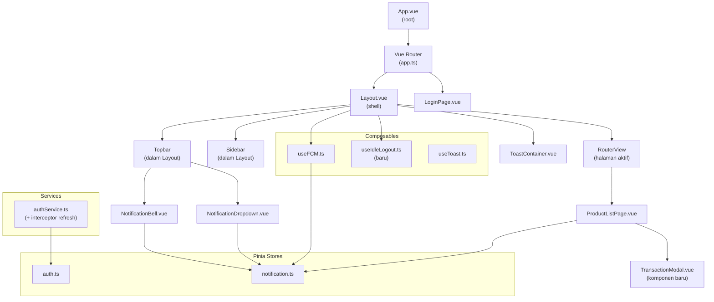
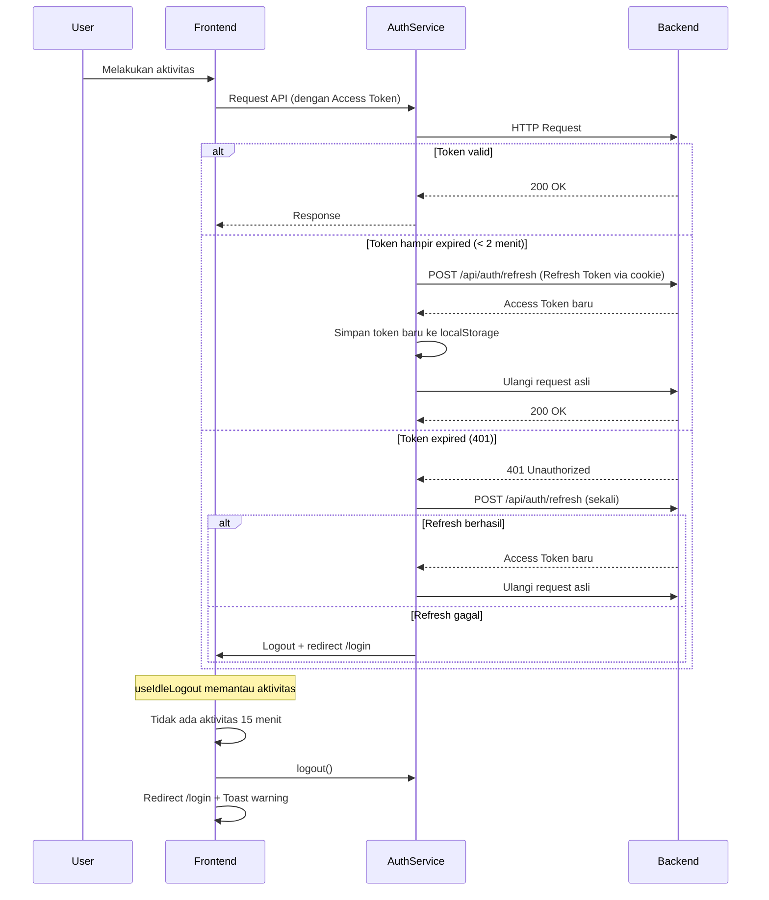
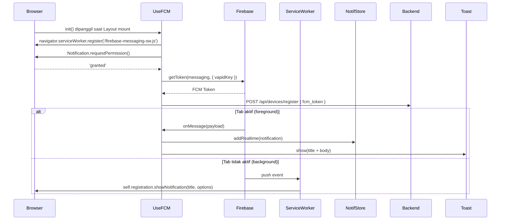

# Dokumen Desain: Inventory SaaS Redesign

## Ikhtisar

Dokumen ini menjabarkan desain teknis untuk overhaul besar aplikasi inventori **Cahaya Prima**. Redesign ini mencakup tujuh area utama: sistem notifikasi, keamanan sesi otomatis (idle logout + JWT silent refresh), alur transaksi berbasis modal, sidebar modern, halaman login split-screen, desain responsif mobile-first, dan micro-interactions.

Stack: **Vue 3 + TypeScript + Pinia + Tailwind CSS + shadcn-vue** (frontend), **Laravel + tymon/jwt-auth** (backend), **Firebase Cloud Messaging** (FCM), **MySQL**.

### Tujuan Desain

- Meningkatkan UX agar setara standar SaaS modern (Notion / Slack / Stripe Dashboard)
- Memperbaiki bug sistem notifikasi (badge count, FCM foreground/background)
- Menambah keamanan sesi: idle auto-logout + JWT silent refresh
- Menyederhanakan alur transaksi: langsung dari halaman produk via modal
- Konsistensi visual dan aksesibilitas di semua breakpoint

---

## Arsitektur

### Diagram Komponen Vue 3



### Diagram Alur Sesi (JWT Silent Refresh + Idle Logout)



### Diagram Alur FCM



---

## Komponen dan Antarmuka

### 1. `useIdleLogout.ts` (Composable Baru)

Composable ini mendeteksi ketidakaktifan pengguna dan melakukan auto-logout setelah 15 menit.

**Antarmuka:**
```typescript
interface UseIdleLogoutOptions {
  timeoutMs?: number        // default: 15 * 60 * 1000 (15 menit)
  onIdle?: () => void       // callback saat idle terdeteksi
}

function useIdleLogout(options?: UseIdleLogoutOptions): {
  lastActivity: Ref<number>  // timestamp aktivitas terakhir
  isIdle: Ref<boolean>       // apakah sedang idle
  reset: () => void          // reset timer manual
  stop: () => void           // hentikan deteksi (untuk halaman publik)
}
```

**Logika:**
- Daftar event yang dipantau: `mousemove`, `click`, `scroll`, `keydown`
- Gunakan `setInterval` setiap 10 detik untuk memeriksa apakah `Date.now() - lastActivity > timeoutMs`
- Pantau `visibilitychange`: saat tab kembali aktif, periksa apakah sudah idle
- Hanya aktif saat pengguna sudah login (cek `authStore.isAuthenticated`)
- Dipanggil di `Layout.vue` `onMounted`, dihentikan di `onUnmounted`

### 2. `useFCM.ts` (Perbaikan Bug)

**Bug yang diperbaiki:**
- `onMessage` dipanggil berulang kali karena tidak ada guard untuk mencegah multiple listener
- Tidak ada penanganan `visibilityState` untuk membedakan foreground/background
- Token tidak dihapus saat logout

**Antarmuka (tidak berubah, hanya implementasi):**
```typescript
function useFCM(): {
  init: () => Promise<void>
  requestPermissionAndRegister: () => Promise<void>
  setupForegroundHandler: () => void
}
```

**Perbaikan:**
- Tambahkan flag `handlerRegistered: boolean` di module scope untuk mencegah duplikasi `onMessage`
- Tambahkan pengecekan `document.visibilityState === 'visible'` di dalam handler
- Ekspor fungsi `unregisterDevice()` untuk dipanggil saat logout

### 3. `NotificationStore` (Pinia) — Perubahan State

**State baru yang ditambahkan:**
```typescript
const error = ref<string | null>(null)          // error message saat fetch gagal
const initialized = ref(false)                  // apakah sudah pernah fetch
```

**Actions baru:**
```typescript
// Reset error state
function clearError(): void

// Fetch dengan error handling yang lebih baik (set error state)
async function fetchNotifications(pageNum?: number): Promise<void>
// Perubahan: set error.value jika gagal, bukan hanya console.error
```

**Perubahan pada `fetchNotifications`:**
- Jika gagal, set `error.value = 'Gagal memuat notifikasi'`
- Jika berhasil, set `error.value = null` dan `initialized.value = true`

### 4. `TransactionModal.vue` (Komponen Baru)

**Props:**
```typescript
interface TransactionModalProps {
  modelValue: boolean                    // v-model untuk open/close
  mode: 'masuk' | 'keluar'              // jenis transaksi
  product: Product | null               // produk yang dipilih (pre-fill)
}
```

**Emits:**
```typescript
interface TransactionModalEmits {
  'update:modelValue': [value: boolean]
  'saved': [updatedProduct: Product]    // emit setelah berhasil simpan
}
```

**Struktur template:**
```
Teleport(to="body")
  └── Overlay (backdrop)
      └── Dialog (role="dialog", aria-modal="true")
          ├── Header (judul + tombol close)
          ├── Body (form fields)
          │   ├── Nama Produk (read-only)
          │   ├── Jumlah (number input, min=1)
          │   ├── Tanggal (date input, default today)
          │   ├── Supplier (text, hanya mode masuk)
          │   └── Harga Beli (number, hanya mode masuk)
          └── Footer (tombol Batal + Simpan)
```

**Focus trap:** Gunakan `useFocusTrap` atau implementasi manual dengan `Tab`/`Shift+Tab` key handler.

### 5. `ProductListPage.vue` — Perubahan

**Tombol baru di header:**
- `[+ Barang Masuk]` → buka `TransactionModal` mode `masuk`
- `[- Barang Keluar]` → buka `TransactionModal` mode `keluar`

**Tombol per baris di kolom Aksi:**
- Tambahkan dua tombol kecil: `↑ Masuk` dan `↓ Keluar` di samping tombol Edit/Hapus
- Klik tombol → set `selectedProduct` dan `transactionMode`, buka modal

**State baru:**
```typescript
const showTransactionModal = ref(false)
const selectedProduct = ref<Product | null>(null)
const transactionMode = ref<'masuk' | 'keluar'>('masuk')
```

**Handler `onSaved`:**
- Terima `updatedProduct` dari emit modal
- Update `products.value` dengan data terbaru tanpa reload

### 6. `Layout.vue` — Perubahan Sidebar

**Perubahan struktur:**
- Hapus menu "Transaksi" dari `NAV_ITEMS` (sesuai Persyaratan 9.1)
- Lebar sidebar expanded: `w-[260px]` (dari `w-60` = 240px)
- Tambahkan integrasi `useIdleLogout` di `onMounted`

**Perubahan visual sidebar:**
- Gunakan ikon Lucide untuk semua item menu (ganti inline SVG)
- Bagian bawah: tampilkan nama lengkap + email + badge peran
- Active state: `bg-primary/10 text-primary` (sesuai Persyaratan 10.3)

### 7. `LoginPage.vue` — Sudah Diimplementasi

LoginPage sudah menggunakan layout split-screen sesuai requirements. Tidak ada perubahan struktural yang diperlukan. Perubahan minor:
- Redirect kasir ke `/products` (bukan `/transactions/out`) sesuai Persyaratan 11.8

---

## Model Data

### Perubahan `LoginResponse` (types/auth.ts)

Tambahkan `refresh_token` ke response login untuk disimpan di cookie:
```typescript
export interface LoginResponse {
  success: boolean
  data: {
    token: string           // access token (15 menit)
    refresh_token?: string  // refresh token (7 hari) — disimpan backend via httpOnly cookie
    user: User
  }
}
```

### Model `UserDevice` (sudah ada di backend)

```typescript
interface UserDevice {
  id: number
  user_id: number
  fcm_token: string
  device_name: string
  refresh_token_id: string | null
  last_active_at: string
  created_at: string
  updated_at: string
}
```

### State `NotificationStore` (lengkap)

```typescript
interface NotificationStoreState {
  notifications: Notification[]
  loading: boolean
  error: string | null        // BARU
  initialized: boolean        // BARU
  hasMore: boolean
  page: number
}
```

### Konfigurasi `useIdleLogout`

```typescript
interface IdleLogoutConfig {
  timeoutMs: number           // 15 * 60 * 1000
  checkIntervalMs: number     // 10 * 1000
  events: string[]            // ['mousemove', 'click', 'scroll', 'keydown']
}
```

---

## Properti Kebenaran (Correctness Properties)

*Properti adalah karakteristik atau perilaku yang harus berlaku di semua eksekusi valid sistem — pada dasarnya, pernyataan formal tentang apa yang seharusnya dilakukan sistem. Properti berfungsi sebagai jembatan antara spesifikasi yang dapat dibaca manusia dan jaminan kebenaran yang dapat diverifikasi mesin.*

Library PBT yang digunakan: **[fast-check](https://github.com/dubzzz/fast-check)** (sudah ada di `node_modules`).

---

### Properti 1: Badge menampilkan angka yang benar

*Untuk sembarang* integer N antara 1 dan 9, jika `unreadCount = N` maka badge NotificationBell harus menampilkan teks `N`. Jika `unreadCount > 9`, badge harus menampilkan teks `"9+"`. Jika `unreadCount = 0`, badge tidak boleh ditampilkan.

**Validates: Requirements 1.2, 4.2, 4.3, 4.4, 4.6**

---

### Properti 2: Notifikasi baru selalu di posisi paling atas

*Untuk sembarang* notifikasi baru N dan daftar notifikasi yang sudah ada, setelah `addRealtime(N)` dipanggil, `notifications[0]` harus sama dengan N dan panjang daftar harus bertambah satu.

**Validates: Requirements 1.5**

---

### Properti 3: FCM token selalu dikirim ke backend setelah izin diberikan

*Untuk sembarang* FCM token string T yang valid, jika izin notifikasi diberikan (`'granted'`), maka `registerDevice(T)` harus dipanggil tepat satu kali dengan token T.

**Validates: Requirements 2.2, 3.1**

---

### Properti 4: Idle logout terpicu setelah inaktivitas >= 15 menit

*Untuk sembarang* durasi idle T >= 15 menit (900.000ms), fungsi logout harus dipanggil dan pengguna diarahkan ke `/login`. Untuk T < 15 menit, logout tidak boleh dipanggil.

**Validates: Requirements 6.2, 6.7**

---

### Properti 5: Reset timer idle saat ada aktivitas

*Untuk sembarang* event aktivitas (mousemove, click, scroll, keydown), `lastActivity` harus diperbarui ke timestamp saat event terjadi, dan timer idle harus direset ke 0.

**Validates: Requirements 6.1, 6.4**

---

### Properti 6: Silent refresh dipanggil saat token hampir expired

*Untuk sembarang* access token dengan sisa waktu berlaku T < 2 menit, interceptor Axios harus secara otomatis memanggil `POST /api/auth/refresh` sebelum meneruskan request asli.

**Validates: Requirements 7.4**

---

### Properti 7: Token baru tersimpan di localStorage setelah silent refresh berhasil

*Untuk sembarang* token baru T yang dikembalikan dari endpoint refresh, `localStorage.getItem('auth_token')` harus mengembalikan T setelah refresh berhasil.

**Validates: Requirements 7.5**

---

### Properti 8: Interceptor 401 mencoba refresh tepat satu kali

*Untuk sembarang* request API yang mengembalikan HTTP 401 (bukan dari endpoint `/auth/logout`), interceptor harus mencoba silent refresh tepat satu kali. Jika refresh gagal, logout harus dipanggil. Jika refresh berhasil, request asli harus diulang.

**Validates: Requirements 7.7**

---

### Properti 9: TransactionModal terbuka dengan produk yang benar

*Untuk sembarang* produk P dalam daftar produk, ketika tombol transaksi pada baris P diklik, TransactionModal harus terbuka dengan `product.id === P.id` dan `product.name === P.name` sudah terisi di field nama produk.

**Validates: Requirements 9.3, 9.4**

---

### Properti 10: Validasi jumlah transaksi menolak nilai <= 0

*Untuk sembarang* integer N <= 0 yang dimasukkan ke field jumlah TransactionModal, submit harus ditolak, pesan validasi harus ditampilkan, dan tidak ada request API yang dikirim.

**Validates: Requirements 9.9**

---

### Properti 11: Stok produk diperbarui setelah transaksi berhasil

*Untuk sembarang* transaksi masuk dengan quantity Q pada produk P dengan stok awal S, setelah modal berhasil menyimpan, stok P di `ProductListPage` harus menjadi S + Q tanpa reload halaman penuh.

**Validates: Requirements 9.11**

---

## Penanganan Error

### Strategi Error Handling per Komponen

| Komponen | Kondisi Error | Penanganan |
|---|---|---|
| `NotificationDropdown` | Gagal fetch API | Tampilkan pesan error + tombol retry |
| `useFCM` | Permission ditolak | `console.warn`, lanjutkan tanpa FCM |
| `useFCM` | Firebase tidak dikonfigurasi | Skip inisialisasi, tidak ada error |
| `useFCM` | Registrasi device gagal | `console.error`, tidak ganggu UX |
| `useIdleLogout` | Logout gagal | Force redirect ke `/login` |
| `AuthService` | Refresh token expired | Logout + Toast "Sesi berakhir" |
| `AuthService` | 401 dari API | Coba refresh sekali, lalu logout |
| `TransactionModal` | Stok tidak cukup | Tampilkan error dari server, modal tetap terbuka |
| `TransactionModal` | Input tidak valid | Tampilkan pesan validasi inline |
| `ProductListPage` | Gagal load produk | Tampilkan alert error dengan tombol retry |

### Kode Error dari Backend

```typescript
// Error response format (sudah ada)
interface ApiError {
  success: false
  error: {
    code: string      // e.g. 'INSUFFICIENT_STOCK', 'BUSINESS_RULE_VIOLATION'
    message: string   // pesan yang bisa ditampilkan ke pengguna
  }
}
```

### Penanganan 401 dengan Retry

```typescript
// Di authService.ts — interceptor response
let isRefreshing = false
let failedQueue: Array<{ resolve: Function; reject: Function }> = []

axios.interceptors.response.use(
  (response) => response,
  async (error) => {
    const originalRequest = error.config
    const is401 = error?.response?.status === 401
    const isLogout = originalRequest?.url?.includes('/auth/logout')
    const isRefreshEndpoint = originalRequest?.url?.includes('/auth/refresh')

    if (is401 && !isLogout && !isRefreshEndpoint && !originalRequest._retry) {
      if (isRefreshing) {
        // Antri request yang gagal
        return new Promise((resolve, reject) => {
          failedQueue.push({ resolve, reject })
        })
      }
      originalRequest._retry = true
      isRefreshing = true
      try {
        const { data } = await axios.post('/api/auth/refresh')
        setToken(data.data.token)
        processQueue(null, data.data.token)
        return axios(originalRequest)
      } catch (refreshError) {
        processQueue(refreshError, null)
        removeToken(); removeUser()
        window.location.href = '/login'
        return Promise.reject(refreshError)
      } finally {
        isRefreshing = false
      }
    }
    return Promise.reject(error)
  }
)
```

---

## Strategi Testing

### Pendekatan Dual Testing

Fitur ini menggunakan dua pendekatan testing yang saling melengkapi:

1. **Unit tests (example-based)**: Memverifikasi perilaku spesifik, edge case, dan kondisi error
2. **Property tests (fast-check)**: Memverifikasi properti universal di berbagai input

### Konfigurasi Property-Based Testing

Library: **fast-check** (sudah tersedia di project)

```typescript
// Konfigurasi minimum per property test
fc.assert(fc.property(...), { numRuns: 100 })
```

Tag format untuk setiap property test:
```
// Feature: inventory-saas-redesign, Property {N}: {deskripsi singkat}
```

### Rencana Test per Area

#### NotificationStore & NotificationBell
```
Unit tests:
- fetchNotifications() mengisi state notifications
- fetchNotifications() gagal → error state terisi
- markAsRead() mengubah is_read = true
- markAllAsRead() mengubah semua is_read = true
- addRealtime() menambah ke index 0

Property tests:
- [Properti 1] Badge count untuk sembarang N
- [Properti 2] addRealtime selalu prepend
```

#### useFCM
```
Unit tests:
- init() tidak melempar error jika Firebase tidak dikonfigurasi
- init() memanggil requestPermission saat dikonfigurasi
- Permission ditolak → console.warn, tidak ada error

Property tests:
- [Properti 3] Token selalu dikirim setelah izin diberikan
- [Properti 5b] onMessage handler dipanggil untuk sembarang payload
```

#### useIdleLogout
```
Unit tests:
- Event listeners terdaftar saat init
- Event listeners dihapus saat stop()
- Tidak aktif di halaman publik

Property tests:
- [Properti 4] Logout terpicu untuk T >= 15 menit
- [Properti 5] Reset timer untuk sembarang event aktivitas
```

#### AuthService (JWT Interceptor)
```
Unit tests:
- Token tersimpan di localStorage setelah login
- Token dihapus setelah logout
- 401 dari /auth/logout tidak memicu refresh

Property tests:
- [Properti 6] Silent refresh untuk token hampir expired
- [Properti 7] Token baru tersimpan setelah refresh
- [Properti 8] Retry tepat satu kali untuk 401
```

#### TransactionModal
```
Unit tests:
- Modal terbuka dengan mode yang benar
- Klik overlay menutup modal
- Escape key menutup modal
- Focus trap berfungsi
- ARIA attributes ada

Property tests:
- [Properti 9] Modal terbuka dengan produk yang benar
- [Properti 10] Validasi menolak jumlah <= 0
- [Properti 11] Stok diperbarui setelah transaksi berhasil
```

### Contoh Implementasi Property Test

```typescript
// Feature: inventory-saas-redesign, Property 2: addRealtime selalu prepend
import * as fc from 'fast-check'
import { setActivePinia, createPinia } from 'pinia'
import { useNotificationStore } from '@/stores/notification'

describe('NotificationStore - Property 2', () => {
  beforeEach(() => setActivePinia(createPinia()))

  it('addRealtime selalu menambahkan notifikasi ke posisi paling atas', () => {
    fc.assert(
      fc.property(
        fc.array(fc.record({
          id: fc.integer({ min: 1 }),
          title: fc.string({ minLength: 1 }),
          message: fc.string(),
          type: fc.constantFrom('success', 'warning', 'danger', 'info'),
          is_read: fc.boolean(),
          user_id: fc.integer(),
          link: fc.option(fc.string(), { nil: null }),
          created_at: fc.string(),
          updated_at: fc.string(),
        })),
        fc.record({
          id: fc.integer({ min: 1000 }),
          title: fc.string({ minLength: 1 }),
          message: fc.string(),
          type: fc.constantFrom('success', 'warning', 'danger', 'info') as fc.Arbitrary<'success' | 'warning' | 'danger' | 'info'>,
          is_read: fc.constant(false),
          user_id: fc.integer(),
          link: fc.constant(null),
          created_at: fc.constant(new Date().toISOString()),
          updated_at: fc.constant(new Date().toISOString()),
        }),
        (existingNotifs, newNotif) => {
          const store = useNotificationStore()
          store.notifications = existingNotifs as any
          const prevLength = existingNotifs.length

          store.addRealtime(newNotif as any)

          expect(store.notifications[0]).toEqual(newNotif)
          expect(store.notifications.length).toBe(prevLength + 1)
        }
      ),
      { numRuns: 100 }
    )
  })
})
```

---

## Strategi Responsif dan CSS

### Breakpoint Strategy (Mobile-First)

```css
/* Mobile-first: default styles untuk ≤ 767px */
/* sm: 640px — tidak digunakan sebagai breakpoint utama */
/* md: 768px — tablet */
/* lg: 1024px — laptop (sidebar muncul permanen) */
/* xl: 1280px — desktop */
/* 2xl: 1536px — layar lebar */
```

### Sidebar Responsive Behavior

| Breakpoint | Perilaku Sidebar |
|---|---|
| Mobile (< 1024px) | Tersembunyi, muncul sebagai drawer via hamburger |
| Desktop (≥ 1024px) | Selalu terlihat, lebar 260px |

### TransactionModal Responsive

| Breakpoint | Perilaku Modal |
|---|---|
| Mobile | `fixed inset-x-0 bottom-0`, tinggi `max-h-[90vh]`, scroll internal |
| Desktop | `fixed inset-0 flex items-center justify-center`, lebar `max-w-md` |

### Touch Target

Semua elemen interaktif memiliki ukuran minimal `44×44px` menggunakan padding atau `min-h-[44px] min-w-[44px]`.

---

## Micro-Interactions CSS

### Animasi yang Diperlukan

```css
/* Badge bounce (NotificationBell) */
@keyframes badge-bounce {
  0%, 100% { transform: scale(1); }
  50%       { transform: scale(1.3); }
}
.badge-bounce { animation: badge-bounce 0.4s ease; }

/* Modal scale-in (TransactionModal) */
@keyframes modal-scale-in {
  from { opacity: 0; transform: scale(0.95) translateY(8px); }
  to   { opacity: 1; transform: scale(1) translateY(0); }
}
.modal-scale-in { animation: modal-scale-in 0.15s ease; }

/* Dropdown slide-down (NotificationDropdown) */
/* Sudah ada via Vue Transition + CSS */

/* Toast slide-in (sudah ada di app.css) */
/* Page transition (sudah ada di app.css) */
```

### Prinsip Animasi

- Semua transisi menggunakan `ease` atau `ease-in-out`, bukan `linear`
- Durasi: 150ms untuk hover/dropdown, 200ms untuk toast, 400ms untuk badge bounce
- Gunakan `will-change: transform` hanya untuk animasi yang sering dipicu

---

## Keputusan Desain

### Mengapa `useIdleLogout` sebagai composable terpisah?

Memisahkan logika idle detection ke composable sendiri memungkinkan:
- Testing yang terisolasi tanpa perlu mount Layout.vue
- Reuse di komponen lain jika diperlukan
- Konfigurasi timeout yang mudah diubah

### Mengapa TransactionModal menggunakan `Teleport to="body"`?

Menggunakan Teleport memastikan modal selalu berada di atas semua konten lain (z-index tidak terpengaruh oleh stacking context parent), dan overlay backdrop bekerja dengan benar di semua breakpoint.

### Mengapa Refresh Token disimpan di httpOnly cookie?

httpOnly cookie tidak dapat diakses oleh JavaScript, sehingga lebih aman dari serangan XSS dibandingkan menyimpan di localStorage. Access token yang berumur pendek (15 menit) di localStorage masih dapat diterima karena risikonya lebih terbatas.

### Mengapa menu Transaksi dihapus dari Sidebar?

Berdasarkan Persyaratan 9.1, alur transaksi dipindahkan langsung ke halaman produk via modal. Ini mengurangi jumlah klik yang diperlukan dan membuat navigasi lebih efisien. Halaman `/transactions` tetap ada untuk riwayat, tetapi tidak perlu di sidebar.
