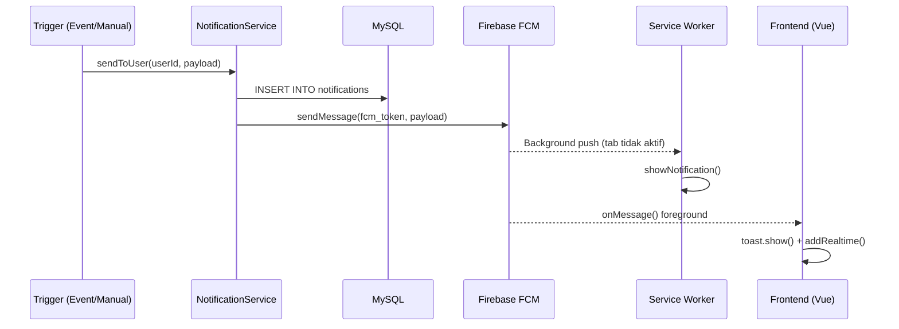
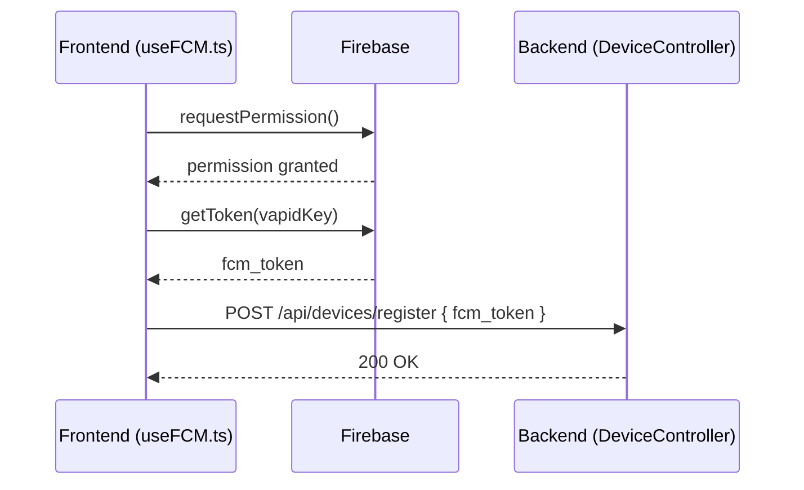

# Dokumen Desain: Notification and Transaction UI

## Ikhtisar

Fitur ini mencakup dua peningkatan utama pada sistem inventori berbasis Laravel + Vue 3:

1. **Sistem Notifikasi Lengkap dengan FCM** — Memperluas notifikasi in-memory yang sudah ada menjadi sistem notifikasi persisten berbasis database dengan push notification via Firebase Cloud Messaging (FCM). Notifikasi disimpan di MySQL, dikirim melalui `kreait/laravel-firebase`, dan diterima di frontend via FCM client SDK.

2. **Halaman Transaksi Terpadu** — Menggabungkan `TransactionInPage.vue` dan `TransactionOutPage.vue` menjadi satu halaman `/transactions` dengan tab switcher, serta menambahkan tombol akses cepat di halaman produk.

Stack yang digunakan:
- **Frontend**: Vue 3 + TypeScript + Pinia + Tailwind CSS (radix-vue, lucide-vue-next)
- **Backend**: Laravel (PHP) dengan JWT via `tymon/jwt-auth`
- **Push Notification**: Firebase Cloud Messaging via `kreait/laravel-firebase`
- **Database**: MySQL

---

## Arsitektur

```mermaid
graph TD
    subgraph Frontend ["Frontend (Vue 3 + TypeScript)"]
        A[Layout.vue] --> B[NotificationBell.vue]
        A --> C[NotificationDropdown.vue]
        D[useFCM.ts] --> E[firebase-messaging-sw.js]
        D --> F[NotificationStore]
        F --> B
        F --> C
        G[TransactionPage.vue] --> H[TransactionInForm.vue]
        G --> I[TransactionOutForm.vue]
        J[ProductListPage.vue]
    end

    subgraph Backend ["Backend (Laravel)"]
        K[NotificationController] --> L[NotificationService]
        M[DeviceController]
        L --> N[Notification Model]
        L --> O[FCM via kreait/laravel-firebase]
        N --> P[(MySQL: notifications)]
        M --> Q[(MySQL: user_devices)]
    end

    D -->|POST /api/devices/register| M
    F -->|GET /api/notifications| K
    F -->|PATCH /api/notifications/{id}/read| K
    F -->|PATCH /api/notifications/read-all| K
    O -->|FCM Push| E
    O -->|FCM Foreground| D
```

---

## Diagram Sequence

### Alur Kirim Notifikasi



### Alur Registrasi FCM Token



---

## Database Schema (Laravel Migrations)

### Tabel `notifications`

```sql
Schema::create('notifications', function (Blueprint $table) {
    $table->id();
    $table->foreignId('user_id')->constrained()->onDelete('cascade');
    $table->string('title');
    $table->text('message');
    $table->enum('type', ['success', 'warning', 'danger', 'info'])->default('info');
    $table->string('link')->nullable();
    $table->boolean('is_read')->default(false);
    $table->timestamps();

    $table->index(['user_id', 'is_read']);
    $table->index(['user_id', 'created_at']);
});
```

### Tabel `user_devices`

```sql
Schema::create('user_devices', function (Blueprint $table) {
    $table->id();
    $table->foreignId('user_id')->constrained()->onDelete('cascade');
    $table->string('fcm_token')->unique();
    $table->json('device_info')->nullable();
    $table->timestamps();

    $table->index('user_id');
});
```

---

## Backend Laravel API

### Model

```php
// app/Models/Notification.php
class Notification extends Model
{
    protected $fillable = ['user_id', 'title', 'message', 'type', 'link', 'is_read'];
    protected $casts = ['is_read' => 'boolean'];

    public function user(): BelongsTo
    {
        return $this->belongsTo(User::class);
    }
}

// app/Models/UserDevice.php
class UserDevice extends Model
{
    protected $fillable = ['user_id', 'fcm_token', 'device_info'];
    protected $casts = ['device_info' => 'array'];

    public function user(): BelongsTo
    {
        return $this->belongsTo(User::class);
    }
}
```

### NotificationService

```php
// app/Services/NotificationService.php
class NotificationService
{
    public function sendToUser(int $userId, array $payload): Notification
    {
        // 1. Simpan ke database
        $notification = Notification::create([
            'user_id' => $userId,
            'title'   => $payload['title'],
            'message' => $payload['message'],
            'type'    => $payload['type'],   // success|warning|danger|info
            'link'    => $payload['link'] ?? null,
        ]);

        // 2. Kirim FCM ke semua device user
        $devices = UserDevice::where('user_id', $userId)->get();
        foreach ($devices as $device) {
            $this->sendFcm($device->fcm_token, $payload, $notification->id);
        }

        return $notification;
    }

    private function sendFcm(string $token, array $payload, int $notifId): void
    {
        // Menggunakan kreait/laravel-firebase
        $messaging = app('firebase.messaging');
        $message = CloudMessage::withTarget('token', $token)
            ->withNotification(Notification::create($payload['title'], $payload['message']))
            ->withData([
                'notification_id' => (string) $notifId,
                'type'            => $payload['type'],
                'link'            => $payload['link'] ?? '',
            ]);
        $messaging->send($message);
    }
}
```

### Endpoint API

```
POST   /api/notifications/send        — kirim notif ke user (admin/sistem)
GET    /api/notifications             — ambil notif user (pagination, latest first)
PATCH  /api/notifications/{id}/read  — mark single as read
PATCH  /api/notifications/read-all   — mark all as read
POST   /api/devices/register         — simpan FCM token user
DELETE /api/devices/unregister       — hapus FCM token saat logout
```

### NotificationController

```php
// app/Http/Controllers/NotificationController.php
class NotificationController extends Controller
{
    public function __construct(private NotificationService $service) {}

    // GET /api/notifications
    public function index(Request $request): JsonResponse
    {
        $userId = auth()->id();
        $notifications = Notification::where('user_id', $userId)
            ->orderBy('created_at', 'desc')
            ->paginate(20);
        return response()->json($notifications);
    }

    // POST /api/notifications/send
    public function send(Request $request): JsonResponse
    {
        $validated = $request->validate([
            'user_id' => 'required|exists:users,id',
            'title'   => 'required|string|max:255',
            'message' => 'required|string',
            'type'    => 'required|in:success,warning,danger,info',
            'link'    => 'nullable|string',
        ]);
        // user_id diambil dari request hanya untuk admin/sistem
        // endpoint ini dilindungi middleware role:pengelola
        $notif = $this->service->sendToUser($validated['user_id'], $validated);
        return response()->json($notif, 201);
    }

    // PATCH /api/notifications/{id}/read
    public function markRead(int $id): JsonResponse
    {
        $notif = Notification::where('id', $id)
            ->where('user_id', auth()->id())
            ->firstOrFail();
        $notif->update(['is_read' => true]);
        return response()->json(['success' => true]);
    }

    // PATCH /api/notifications/read-all
    public function markAllRead(): JsonResponse
    {
        Notification::where('user_id', auth()->id())
            ->where('is_read', false)
            ->update(['is_read' => true]);
        return response()->json(['success' => true]);
    }
}
```

### DeviceController

```php
// app/Http/Controllers/DeviceController.php
class DeviceController extends Controller
{
    // POST /api/devices/register
    public function register(Request $request): JsonResponse
    {
        $validated = $request->validate([
            'fcm_token'   => 'required|string',
            'device_info' => 'nullable|array',
        ]);
        UserDevice::updateOrCreate(
            ['fcm_token' => $validated['fcm_token']],
            ['user_id' => auth()->id(), 'device_info' => $validated['device_info'] ?? null]
        );
        return response()->json(['success' => true]);
    }

    // DELETE /api/devices/unregister
    public function unregister(Request $request): JsonResponse
    {
        $request->validate(['fcm_token' => 'required|string']);
        UserDevice::where('user_id', auth()->id())
            ->where('fcm_token', $request->fcm_token)
            ->delete();
        return response()->json(['success' => true]);
    }
}
```

---

## Tipe Notifikasi

| Tipe      | Warna  | Icon Lucide       | Kelas Tailwind          |
|-----------|--------|-------------------|-------------------------|
| `success` | Hijau  | `CheckCircle`     | `text-green-600 bg-green-50`  |
| `warning` | Kuning | `AlertTriangle`   | `text-yellow-600 bg-yellow-50` |
| `danger`  | Merah  | `XCircle`         | `text-red-600 bg-red-50`      |
| `info`    | Biru   | `Info`            | `text-blue-600 bg-blue-50`    |

---

## Komponen dan Interface Frontend

### NotificationStore (notification.ts) — Diperbarui Total

```typescript
// resources/js/stores/notification.ts

export type NotificationType = 'success' | 'warning' | 'danger' | 'info'

export interface Notification {
  id: number
  user_id: number
  title: string
  message: string
  type: NotificationType
  link: string | null
  is_read: boolean
  created_at: string
  updated_at: string
}

interface NotificationState {
  notifications: Notification[]
  unreadCount: number
  loading: boolean
  hasMore: boolean
  page: number
}

// Actions:
// fetchNotifications(page?)  — GET /api/notifications
// markAsRead(id)             — PATCH /api/notifications/{id}/read
// markAllAsRead()            — PATCH /api/notifications/read-all
// addRealtime(notification)  — tambah notif baru dari FCM foreground
// registerDevice(token)      — POST /api/devices/register
```

**Catatan backward compatibility**: `lowStockAlerts` computed dan `addLowStockAlert` / `dismissAlert` tetap dipertahankan sebagai alias untuk kompatibilitas dengan `TransactionInForm.vue` yang sudah ada.

### NotificationBell.vue

```typescript
// resources/js/components/NotificationBell.vue
// Props: tidak ada
// Emits: tidak ada
// Behavior:
//   - Selalu tampilkan icon Bell dari lucide-vue-next
//   - Badge merah dengan angka jika unreadCount 1-9
//   - Badge merah dengan "9+" jika unreadCount > 9
//   - Sembunyikan badge jika unreadCount === 0
//   - Klik → toggle NotificationDropdown (bukan navigate)
//   - Badge animate bounce saat unreadCount bertambah (CSS keyframe)
```

### NotificationDropdown.vue (BARU)

```typescript
// resources/js/components/NotificationDropdown.vue
// Props: modelValue: boolean (v-model untuk open/close)
// Emits: update:modelValue
// Behavior:
//   - Dropdown panel di bawah bell icon
//   - Scrollable list (max-height: 400px)
//   - Grouping: Hari ini / Kemarin / Lebih lama
//   - Per item: icon sesuai type, title, message, timestamp relatif
//   - bg-blue-50 jika is_read === false, hover: bg-gray-50
//   - Button "Tandai semua dibaca" → markAllAsRead()
//   - Empty state: "Tidak ada notifikasi" + ilustrasi
//   - Skeleton loading (3 placeholder) saat loading === true
//   - Klik item → navigate ke link + markAsRead(id)
//   - Fade + slide-down transition saat buka/tutup
```

### useFCM.ts (Composable BARU)

```typescript
// resources/js/composables/useFCM.ts
export function useFCM() {
  // 1. Inisialisasi Firebase app dengan config dari env
  // 2. requestPermission() — minta izin notifikasi browser
  // 3. getToken(vapidKey) — dapatkan FCM token
  // 4. registerDevice(token) — POST /api/devices/register
  // 5. onMessage(app, handler) — foreground message handler
  //    → toast.show(title, message)
  //    → notifStore.addRealtime(notification)
  // 6. Setup service worker registration

  async function init(): Promise<void>
  async function requestPermissionAndRegister(): Promise<void>
  function setupForegroundHandler(): void
}
```

### firebase-messaging-sw.js (Service Worker BARU)

```javascript
// public/firebase-messaging-sw.js
// Background message handler untuk FCM
// Tampilkan notifikasi browser saat tab tidak aktif

importScripts('https://www.gstatic.com/firebasejs/10.x.x/firebase-app-compat.js')
importScripts('https://www.gstatic.com/firebasejs/10.x.x/firebase-messaging-compat.js')

firebase.initializeApp({ /* config dari env */ })
const messaging = firebase.messaging()

messaging.onBackgroundMessage((payload) => {
  self.registration.showNotification(payload.notification.title, {
    body: payload.notification.body,
    icon: '/favicon.ico',
    data: payload.data,
  })
})
```

### Layout.vue — Perubahan

```typescript
// Perubahan di Layout.vue:
// 1. Import NotificationBell dan NotificationDropdown
// 2. Ganti blok <button v-if="notifStore.lowStockAlerts.length"> dengan <NotificationBell />
// 3. Tambahkan <NotificationDropdown v-model="showDropdown" />
// 4. Hapus ref showNotifPanel, ganti dengan showDropdown
// 5. Panggil useFCM().init() di onMounted
// 6. Ganti dua nav item "Transaksi Masuk" & "Transaksi Keluar" → satu "Transaksi" ke /transactions
```

---

## Komponen Transaksi (Dipertahankan dari Desain Sebelumnya)

### TransactionInForm.vue

Komponen form untuk mencatat transaksi masuk (penerimaan barang dari supplier). Logika identik dengan `TransactionInPage.vue` yang sudah ada.

```typescript
// resources/js/components/TransactionInForm.vue
// Emits: success({ productName: string, quantity: number, currentStock: number })
// Behavior:
//   - Validasi form: product_id, quantity (integer > 0), transaction_date, supplier_name, price_per_unit
//   - Panggil createTransactionIn() dari transactionService
//   - Jika result.low_stock_warning → notifStore.addLowStockAlert(...)
//   - Emit 'success' setelah berhasil
//   - Toast sukses via useToast
```

### TransactionOutForm.vue

Komponen form untuk mencatat transaksi keluar (penjualan/pengeluaran barang).

```typescript
// resources/js/components/TransactionOutForm.vue
// Emits: success({ productName: string, quantity: number, currentStock: number })
// Behavior:
//   - Validasi form: product_id, quantity (integer > 0, tidak melebihi stok), transaction_date, price_per_unit
//   - Panggil createTransactionOut() dari transactionService
//   - Emit 'success' setelah berhasil
//   - Toast sukses via useToast
```

### TransactionPage.vue

Halaman terpadu yang menggabungkan TransactionInForm dan TransactionOutForm.

```typescript
// resources/js/pages/TransactionPage.vue
// Route: /transactions
// Roles: pengelola, kasir
// Behavior:
//   - Tab switcher: "Transaksi Masuk" | "Transaksi Keluar"
//   - Baca query param ?tab= untuk tab aktif awal
//   - Kasir: sembunyikan tab switcher, paksa tab 'out'
//   - Pengelola: default tab 'in'
//   - Handle emit success dari TransactionInForm → notifStore.addTransactionAlert('transaction_in', ...)
//   - Handle emit success dari TransactionOutForm → notifStore.addTransactionAlert('transaction_out', ...)
```

---

## Halaman Notifikasi (NotificationPage.vue)

```typescript
// resources/js/pages/NotificationPage.vue
// Route: /notifications
// Roles: pengelola, kasir
// Behavior:
//   - onMounted: fetchNotifications() + markAllAsRead()
//   - Daftar notifikasi diurutkan terbaru di atas
//   - Icon + warna per tipe (success/warning/danger/info)
//   - Waktu relatif (contoh: "2 menit lalu")
//   - Tombol dismiss (×) per item → dismissNotification(id)
//   - Tombol "Tandai semua dibaca" dan "Hapus semua"
//   - Filter tab: Semua | Success | Warning | Danger | Info
//   - Empty state jika tidak ada notifikasi
//   - Infinite scroll atau pagination untuk load more
```

---

## ProductListPage — Perubahan

```typescript
// Tambahkan di header ProductListPage.vue:
// Tombol "Transaksi" di sebelah kiri tombol "Tambah Barang"
// → navigate ke /transactions?tab=in
```

---

## Routing

```typescript
// resources/js/app.ts — perubahan routing:
{
  path: '/transactions',
  component: TransactionPage,
  meta: { roles: ['pengelola', 'kasir'] }
},
{
  path: '/notifications',
  component: NotificationPage,
  meta: { roles: ['pengelola', 'kasir'] }
},
// Redirect dari route lama:
{ path: '/transactions/in', redirect: '/transactions?tab=in' },
{ path: '/transactions/out', redirect: '/transactions?tab=out' },
```

---

## UX & Micro Interactions

```css
/* Badge bounce animation */
@keyframes badge-bounce {
  0%, 100% { transform: scale(1); }
  50%       { transform: scale(1.3); }
}
.badge-bounce { animation: badge-bounce 0.4s ease; }

/* Dropdown fade + slide-down */
.dropdown-enter-active { transition: opacity 0.15s ease, transform 0.15s ease; }
.dropdown-enter-from   { opacity: 0; transform: translateY(-8px); }

/* Toast slide-in dari kanan (sudah ada di useToast.ts) */

/* Skeleton loading */
.skeleton { @apply animate-pulse bg-gray-200 rounded; }
```

Interaksi lainnya:
- Unread item: `bg-blue-50`
- Hover item: `bg-gray-50`
- Skeleton loading: 3 placeholder items saat `loading === true`
- Empty state: icon Bell + teks "Tidak ada notifikasi"
- Sound effect (opsional, disabled by default, toggle di localStorage)

---

## Keamanan

- Semua endpoint `/api/notifications/*` dan `/api/devices/*` dilindungi middleware `auth:api` (JWT)
- `user_id` pada query notifikasi diambil dari JWT token (`auth()->id()`), bukan dari request body
- Endpoint `POST /api/notifications/send` dilindungi middleware `role:pengelola` (hanya admin/sistem)
- FCM token hanya disimpan saat user login (dipanggil di `onMounted` Layout setelah auth)
- FCM token dihapus via `DELETE /api/devices/unregister` saat logout
- Rate limiting pada `POST /api/notifications/send`: 60 request/menit per IP
- Payload FCM tidak mengandung data sensitif (hanya `notification_id`, `type`, `link`)
- Validasi `user_id` pada `markRead` memastikan user hanya bisa mark notifikasi miliknya sendiri

---

## Dependensi Baru

### Frontend (npm)

```json
{
  "dependencies": {
    "firebase": "^10.x.x"
  }
}
```

### Backend (composer)

```json
{
  "require": {
    "kreait/laravel-firebase": "^5.x"
  }
}
```

### Variabel Environment Baru

```dotenv
# Firebase (untuk kreait/laravel-firebase)
FIREBASE_CREDENTIALS=storage/app/firebase-credentials.json
FIREBASE_PROJECT_ID=your-project-id

# Firebase Client SDK (untuk frontend via Vite)
VITE_FIREBASE_API_KEY=
VITE_FIREBASE_AUTH_DOMAIN=
VITE_FIREBASE_PROJECT_ID=
VITE_FIREBASE_MESSAGING_SENDER_ID=
VITE_FIREBASE_APP_ID=
VITE_FIREBASE_VAPID_KEY=
```

---

## Correctness Properties

### Property 1: unreadCount konsisten dengan array

```typescript
// Untuk semua state notifications[]:
// unreadCount === notifications.filter(n => !n.is_read).length
assert(store.unreadCount === store.notifications.filter(n => !n.is_read).length)
```

### Property 2: markAllAsRead mengosongkan unreadCount

```typescript
// Setelah markAllAsRead() berhasil:
await store.markAllAsRead()
assert(store.unreadCount === 0)
assert(store.notifications.every(n => n.is_read === true))
```

### Property 3: markAsRead hanya mengubah satu item

```typescript
// Setelah markAsRead(id):
const before = store.notifications.length
await store.markAsRead(id)
assert(store.notifications.length === before)
assert(store.notifications.find(n => n.id === id)?.is_read === true)
```

### Property 4: addRealtime menambah ke depan array

```typescript
// Setelah addRealtime(newNotif):
const before = store.notifications.length
store.addRealtime(newNotif)
assert(store.notifications.length === before + 1)
assert(store.notifications[0].id === newNotif.id)
```

### Property 5: fetchNotifications mengisi array dari API

```typescript
// Setelah fetchNotifications() berhasil:
await store.fetchNotifications()
assert(store.notifications.length > 0 || store.hasMore === false)
assert(store.loading === false)
```

### Property 6: markAsRead mengubah is_read

```typescript
// Setelah markAsRead(id), item dengan id tersebut harus is_read === true:
await store.markAsRead(id)
const item = store.notifications.find(n => n.id === id)
assert(item?.is_read === true)
```

### Property 7: unreadCount selalu konsisten

```typescript
// Invariant yang harus selalu terpenuhi setelah setiap operasi:
// unreadCount === notifications.filter(n => !n.is_read).length
// Diuji dengan fast-check property test:
fc.assert(fc.property(
  fc.array(notificationArbitrary),
  (notifs) => {
    store.$patch({ notifications: notifs })
    return store.unreadCount === notifs.filter(n => !n.is_read).length
  }
))
```

### Property 8: Backward compatibility lowStockAlerts

```typescript
// lowStockAlerts computed harus mengembalikan notifikasi bertipe 'warning'
// yang dipetakan ke format { productId, productName, currentStock, minStock }
const lowStock = store.notifications.filter(n => n.type === 'warning')
assert(store.lowStockAlerts.length === lowStock.length)
```

### Property 9: FCM token unik per device

```
// Di database user_devices:
// fcm_token memiliki constraint UNIQUE
// updateOrCreate memastikan tidak ada duplikat token
```

### Property 10: Notifikasi hanya milik user yang login

```
// GET /api/notifications hanya mengembalikan notifikasi dengan user_id === auth()->id()
// PATCH /api/notifications/{id}/read memvalidasi user_id sebelum update
```

---

## Strategi Testing

### Unit Testing (Frontend — fast-check)

```typescript
// Test property-based untuk NotificationStore:
// - unreadCount selalu konsisten dengan filter is_read
// - addRealtime selalu menambah ke index 0
// - markAllAsRead mengosongkan unreadCount
```

### Unit Testing (Backend — PHPUnit)

```php
// NotificationServiceTest:
// - sendToUser menyimpan ke DB dan memanggil FCM
// - markRead hanya mengubah notifikasi milik user yang benar
// - markAllRead mengubah semua notifikasi user

// DeviceControllerTest:
// - register menyimpan token baru
// - register update token yang sudah ada (upsert)
// - unregister menghapus token
```

### Integration Testing

```
// Alur end-to-end:
// 1. User login → useFCM.init() → token terdaftar di user_devices
// 2. Trigger notifikasi → tersimpan di DB + FCM terkirim
// 3. Frontend menerima FCM → toast muncul + badge bertambah
// 4. User buka dropdown → fetchNotifications() → list tampil
// 5. User klik item → markAsRead() → bg-blue-50 hilang
// 6. User logout → FCM token dihapus dari user_devices
```
